# P.I.H.U OS (Personal Intelligent Holographic Utility)

> **A futuristic, voice-activated holographic operating system interface built with Electron, React, WebGL, and an advanced local speech pipeline.**

---

## 🌌 Overview

P.I.H.U OS is a translucent overlay utility designed to feel like an ambient, futuristic holographic assistant floating directly over your desktop workspace. It combines premium **glassmorphic aesthetics**, **cinematic WebGL shaders**, and a highly optimized **100% local, zero-dependency audio processing pipeline** powered by Silero VAD v4 and Faster-Whisper.

---

## 📸 Interface Preview
<p align="center">

<em>P.I.H.U -Inactive State (IDLE)</em>
</p>

<p align="center">

<em>P.I.H.U - Active State (Listening)</em>
</p>
---

## 🛠️ System Architecture

P.I.H.U OS is a full-stack AI operating layer spanning a holographic React frontend, Electron OS bridge, and a local Python voice daemon with ONNX model inference. The complete system architecture is visualised below.

> 📄 For a full layer-by-layer breakdown, see [docs/architecture.md](file:///Users/mayankjha/Documents/Projects/PIHU%20OS/docs/architecture.md).

```mermaid
graph TD

    U([User])
    U --> VUI[Voice Interaction]
    U --> GUI[Desktop Overlay UI]
    U --> SCR[Screen Context]
    U --> KBM[Mouse and Keyboard]

    subgraph L1[1 - Presentation Layer]
        ORB[AI Orb Interface]
        WAVE[Waveform Visualizer]
        OVR[Contextual Overlay System]
        CMD[Command Console]
        MENUBAR[macOS Menu Bar Agent]
        NOTIF[Notification System]
    end

    VUI --> ORB
    VUI --> WAVE
    GUI --> OVR
    GUI --> CMD

    subgraph L2[2 - Interaction and Orchestration Layer]
        WAKE[Wake Word Engine]
        STT[Speech-to-Text Engine]
        ROUTER[Intent Router]
        CONTEXT[Context Manager]
        SESSION[Session State Manager]
        TASKFLOW[Workflow Planner]
    end

    ORB --> WAKE
    WAKE --> STT
    STT --> ROUTER
    ROUTER --> CONTEXT
    ROUTER --> TASKFLOW
    CONTEXT --> SESSION

    subgraph L3[3 - PIHU Core Intelligence]
        LLM[Local LLM Engine]
        REASON[Reasoning Engine]
        AGENTS[Multi-Agent Coordinator]
        MEMORY[Semantic Memory System]
        EMBED[Embedding Engine]
        RL[Reinforcement Learning Engine]
    end

    ROUTER --> LLM
    TASKFLOW --> REASON
    LLM --> REASON
    LLM --> AGENTS
    LLM --> MEMORY
    MEMORY --> EMBED
    RL --> MEMORY
    RL --> REASON

    subgraph L4A[4A - System Automation Layer]
        SYSCTL[macOS System Controller]
        APPCTL[Application Controller]
        FILESYS[File System Manager]
        BROWSER[Browser Automation]
        KBCTRL[Keyboard Controller]
        MOUSECTRL[Mouse Controller]
        SHELL[Shell Executor]
    end

    REASON --> SYSCTL
    REASON --> APPCTL
    REASON --> FILESYS
    REASON --> BROWSER
    REASON --> KBCTRL
    REASON --> MOUSECTRL
    REASON --> SHELL

    subgraph L4B[4B - Vision and Screen Understanding]
        SCREEN_CAPTURE[Screen Capture Engine]
        OCR[OCR Engine]
        SCREENAI[Screen Understanding AI]
        UI_DETECT[UI Element Detection]
    end

    SCR --> SCREEN_CAPTURE
    SCREEN_CAPTURE --> OCR
    SCREEN_CAPTURE --> SCREENAI
    SCREEN_CAPTURE --> UI_DETECT
    SCREENAI --> CONTEXT
    OCR --> CONTEXT

    subgraph L4C[4C - Extension Ecosystem]
        VSCODE[VSCode Extension]
        INTELLIJ[IntelliJ Plugin]
        BROWSER_EXT[Browser Extension]
        API_BRIDGE[External AI and API Bridge]
    end

    VSCODE --> CONTEXT
    INTELLIJ --> CONTEXT
    BROWSER_EXT --> CONTEXT
    API_BRIDGE --> AGENTS

    subgraph L5[5 - External AI Systems]
        CLAUDE[Claude]
        ANTIGRAVITY[Antigravity]
        OPENAI[OpenAI APIs]
        LOCAL_AGENTS[Local Agents]
    end

    API_BRIDGE --> CLAUDE
    API_BRIDGE --> ANTIGRAVITY
    API_BRIDGE --> OPENAI
    API_BRIDGE --> LOCAL_AGENTS

    subgraph L6[6 - Local AI Model Layer]
        PHI[Phi-3]
        QWEN[Qwen Coder]
        LLAVA[LLaVA Vision]
        WHISPER[Whisper]
        EMBEDDING_MODEL[Nomic Embed]
    end

    LLM --> PHI
    LLM --> QWEN
    SCREENAI --> LLAVA
    STT --> WHISPER
    EMBED --> EMBEDDING_MODEL

    subgraph L7[7 - Persistent Storage Layer]
        VECTORDB[(Vector DB)]
        SQL[(SQLite)]
        LOGS[(Execution Logs)]
        CACHE[(Local Cache)]
    end

    MEMORY --> VECTORDB
    SESSION --> SQL
    TASKFLOW --> LOGS
    LLM --> CACHE

    subgraph L8[8 - Security and Permission Layer]
        AUTH[Permission Manager]
        SANDBOX[Sandbox System]
        CONFIRM[Action Confirmation]
    end

    SYSCTL --> AUTH
    FILESYS --> SANDBOX
    SHELL --> CONFIRM

    subgraph L9[9 - Adaptive Learning Loop]
        TRACKER[Behavior Tracker]
        PREFS[Preference Learning]
        PATTERN[Workflow Pattern Analysis]
    end

    SESSION --> TRACKER
    TRACKER --> PREFS
    TRACKER --> PATTERN
    PREFS --> RL
    PATTERN --> RL
```




---

## ✨ Key Features

1. **State-of-the-Art Stateful Silero VAD (v4):**
   - Direct CPU inference via locally cached ONNX runtime in **under 1ms**.
   - Dynamically tracks LSTM cell states across rolling 32ms audio frames.
2. **Acoustic Feedback & Echo Muting:**
   - Dual-directional pipe where the frontend tells the background Python listener to `MUTE` its ears during Text-to-Speech playback, completely avoiding self-feedback loop issues.
3. **Dynamic speech endpointing:**
   - Allows natural hesitation pauses (up to **1.2 seconds**) and snappily clips recording upon complete silence.
4. **Offline phonetic word catching:**
   - Prompt guided local Whisper transcription with fuzzy matching catches common phonetic misinterpretations for non-English words.
5. **Futuristic ambient UI:**
   - WebGL plasma energy shaders rendering transparent window compositing over active macOS desktops.

---

## 🚀 Quick Start

### 📋 Prerequisites
- **macOS** with a built-in microphone.
- **Node.js** (v18+) & **Python** (3.10+).
- **PortAudio** (for PyAudio support):
  ```bash
  brew install portaudio
  ```

### ⚙️ Setup
1. Clone the repository and install npm packages:
   ```bash
   npm install
   ```
2. Initialize and configure the Python virtual environment:
   ```bash
   python3 -m venv venv
   source venv/bin/activate
   pip install -r requirements.txt
   ```
3. Run the development server:
   ```bash
   npm run dev
   ```

---

## 📂 Detailed Documentation
For deep-dives into system designs, consult the folder [docs/](file:///Users/mayankjha/Documents/Projects/PIHU%20OS/docs):
*   📄 **[Architecture Deep-Dive](file:///Users/mayankjha/Documents/Projects/PIHU%20OS/docs/architecture.md)** — Core VAD logic and Electron-to-Python IPC loops.
*   📄 **[Setup & Installation Guide](file:///Users/mayankjha/Documents/Projects/PIHU%20OS/docs/setup_guide.md)** — Dependency compilation and Mac hardware config details.
*   📄 **[User Interface & WebGL Orb Design](file:///Users/mayankjha/Documents/Projects/PIHU%20OS/docs/ui_system.md)** — React layouts, Tailwind integration, and custom GLSL shader mechanics.

---

## 📄 License
Licensed under the [MIT License](LICENSE).
