# P.I.H.U OS — System Architecture Documentation

This document covers the complete technical architecture of P.I.H.U OS — from the user-facing holographic interface all the way down to local AI model inference, adaptive learning, and system-level automation.

---

## Complete System Architecture

The diagram is structured **top-to-bottom**, one layer per band. Each subgraph represents a discrete architectural tier. Arrows flow downward through the stack.

```mermaid
graph TD

    U([User])

    U --> VUI[Voice Interaction]
    U --> GUI[Desktop Overlay UI]
    U --> SCR[Screen Context]
    U --> KBM[Mouse and Keyboard]

    subgraph L1[1 - Presentation Layer]
        ORB[AI Orb Interface]
        WAVE[Waveform Visualizer]
        OVR[Contextual Overlay System]
        CMD[Command Console]
        MENUBAR[macOS Menu Bar Agent]
        NOTIF[Notification System]
    end

    VUI --> ORB
    VUI --> WAVE
    GUI --> OVR
    GUI --> CMD

    subgraph L2[2 - Interaction and Orchestration Layer]
        WAKE[Wake Word Engine]
        STT[Speech-to-Text Engine]
        ROUTER[Intent Router]
        CONTEXT[Context Manager]
        SESSION[Session State Manager]
        TASKFLOW[Workflow Planner]
    end

    ORB --> WAKE
    WAKE --> STT
    STT --> ROUTER
    ROUTER --> CONTEXT
    ROUTER --> TASKFLOW
    CONTEXT --> SESSION

    subgraph L3[3 - PIHU Core Intelligence]
        LLM[Local LLM Engine]
        REASON[Reasoning Engine]
        AGENTS[Multi-Agent Coordinator]
        MEMORY[Semantic Memory System]
        EMBED[Embedding Engine]
        RL[Reinforcement Learning Engine]
    end

    ROUTER --> LLM
    TASKFLOW --> REASON
    LLM --> REASON
    LLM --> AGENTS
    LLM --> MEMORY
    MEMORY --> EMBED
    RL --> MEMORY
    RL --> REASON

    subgraph L4A[4A - System Automation Layer]
        SYSCTL[macOS System Controller]
        APPCTL[Application Controller]
        FILESYS[File System Manager]
        BROWSER[Browser Automation]
        KBCTRL[Keyboard Controller]
        MOUSECTRL[Mouse Controller]
        SHELL[Shell Executor]
    end

    REASON --> SYSCTL
    REASON --> APPCTL
    REASON --> FILESYS
    REASON --> BROWSER
    REASON --> KBCTRL
    REASON --> MOUSECTRL
    REASON --> SHELL

    subgraph L4B[4B - Vision and Screen Understanding]
        SCREEN_CAPTURE[Screen Capture Engine]
        OCR[OCR Engine]
        SCREENAI[Screen Understanding AI]
        UI_DETECT[UI Element Detection]
    end

    SCR --> SCREEN_CAPTURE
    SCREEN_CAPTURE --> OCR
    SCREEN_CAPTURE --> SCREENAI
    SCREEN_CAPTURE --> UI_DETECT
    SCREENAI --> CONTEXT
    OCR --> CONTEXT

    subgraph L4C[4C - Extension Ecosystem]
        VSCODE[VSCode Extension]
        INTELLIJ[IntelliJ Plugin]
        BROWSER_EXT[Browser Extension]
        API_BRIDGE[External AI and API Bridge]
    end

    VSCODE --> CONTEXT
    INTELLIJ --> CONTEXT
    BROWSER_EXT --> CONTEXT
    API_BRIDGE --> AGENTS

    subgraph L5[5 - External AI Systems]
        CLAUDE[Claude]
        ANTIGRAVITY[Antigravity]
        OPENAI[OpenAI APIs]
        LOCAL_AGENTS[Local Agents]
    end

    API_BRIDGE --> CLAUDE
    API_BRIDGE --> ANTIGRAVITY
    API_BRIDGE --> OPENAI
    API_BRIDGE --> LOCAL_AGENTS

    subgraph L6[6 - Local AI Model Layer]
        PHI[Phi-3]
        QWEN[Qwen Coder]
        LLAVA[LLaVA Vision]
        WHISPER[Whisper]
        EMBEDDING_MODEL[Nomic Embed]
    end

    LLM --> PHI
    LLM --> QWEN
    SCREENAI --> LLAVA
    STT --> WHISPER
    EMBED --> EMBEDDING_MODEL

    subgraph L7[7 - Persistent Storage Layer]
        VECTORDB[(Vector DB)]
        SQL[(SQLite)]
        LOGS[(Execution Logs)]
        CACHE[(Local Cache)]
    end

    MEMORY --> VECTORDB
    SESSION --> SQL
    TASKFLOW --> LOGS
    LLM --> CACHE

    subgraph L8[8 - Security and Permission Layer]
        AUTH[Permission Manager]
        SANDBOX[Sandbox System]
        CONFIRM[Action Confirmation]
    end

    SYSCTL --> AUTH
    FILESYS --> SANDBOX
    SHELL --> CONFIRM

    subgraph L9[9 - Adaptive Learning Loop]
        TRACKER[Behavior Tracker]
        PREFS[Preference Learning]
        PATTERN[Workflow Pattern Analysis]
    end

    SESSION --> TRACKER
    TRACKER --> PREFS
    TRACKER --> PATTERN
    PREFS --> RL
    PATTERN --> RL
```



---

## Layer Breakdown

### User Layer
The four primary interaction modalities through which the user engages with P.I.H.U:

| Input | Description |
| :--- | :--- |
| Voice Interaction | Primary hands-free activation and command interface via wake word + speech |
| Desktop Overlay UI | Direct mouse/click interactions on floating glassmorphic panels |
| Screen Context | Passive ambient screen reading for automated contextual awareness |
| Mouse & Keyboard | Fine-grained system automation and gesture control |

---

### Layer 1 — Presentation
The visible, animated holographic interface components:

- **AI Orb Interface** — Reactive WebGL plasma shader orb that changes color/turbulence based on voice state.
- **Contextual Overlay System** — Smart panels that spawn over active windows with relevant tools and shortcuts.
- **Command Console** — Terminal-style log and command viewer floating in the overlay.
- **Waveform Visualizer** — Real-time audio amplitude wave drawn from active microphone frames.
- **macOS Menu Bar Agent** — Lightweight persistent background tray icon for quick access.
- **Notification System** — Toasts and ambient glow notifications for completed actions.

---

### Layer 2 — Interaction & Orchestration
The signal processing and intelligence routing backbone:

- **Wake Word Engine** — Powered by stateful Silero VAD v4 ONNX (32ms frames, LSTM state persistence) with optional Picovoice Porcupine integration.
- **Speech-to-Text Engine** — Faster-Whisper (`tiny.en` model, `beam_size=3`) running entirely on CPU with guided `initial_prompt` for phonetic accuracy.
- **Intent Router** — Classifies transcribed speech into action categories (system command, query, code generation, etc.) and dispatches to the appropriate subsystem.
- **Context Manager** — Aggregates screen capture data, session history, and user preferences into a live context window for LLM inference.
- **Session State Manager** — Persists conversation turns, active task state, and user-specific tuning into SQLite.
- **Workflow Planner** — Breaks multi-step tasks into atomic action sequences with rollback support.

---

### Layer 3 — PIHU Core Intelligence
The intelligence layer combining local and optionally external inference:

- **Local LLM Engine** — Routes to the appropriate small language model (Phi-3, Qwen Coder) based on task type.
- **Semantic Memory System** — Chunked vector embeddings stored in a local vector database for long-term retrieval.
- **Reinforcement Learning Engine** — Refines behavior based on user preference signals and workflow outcomes.
- **Reasoning Engine** — Chains multi-step plans, tool calls, and evaluations before acting on the system.
- **Multi-Agent Coordinator** — Spawns sub-agents for parallelizable tasks (e.g., one agent searches the web, another edits a file).
- **Embedding Engine** — Transforms text and screen data into dense semantic vectors for memory storage and retrieval.

---

### Layer 4A — System Automation
Direct OS-level control capabilities:

| Controller | Capability |
| :--- | :--- |
| macOS System Controller | Spotlight, Spaces, Do Not Disturb, volume, brightness |
| Application Controller | Open/close/focus any app, read menu bars |
| File System Manager | Create, read, move, delete files with sandboxed permission |
| Browser Automation | Playwright-based navigation, form fills, and scraping |
| Keyboard Controller | Keystroke synthesis, hotkey invocation |
| Mouse Controller | Click, drag, scroll, and hover automation |
| Shell Executor | Execute arbitrary bash with critical action confirmation dialogs |

---

### Layer 4B — Vision & Screen Understanding
Passive always-on screen comprehension:

- **Screen Capture Engine** — Efficient macOS CGImage-based frame capture at configurable intervals.
- **Screen Understanding AI** — LLaVA vision model interprets screenshots to extract semantic context.
- **OCR Engine** — Extracts text from images, PDFs, and non-selectable UI elements.
- **UI Element Detection** — Locates buttons, input fields, and interactive regions by visual pattern.

---

### Layer 4C — Extension Ecosystem
Third-party integrations that funnel additional context into the orchestration layer:

- **VSCode Extension** — Sends active file, selection, and editor events into PIHU's Context Manager.
- **IntelliJ Plugin** — Same as above, for JVM-based development workflows.
- **Browser Extension** — Forwards active tab URL, page title, and selected text as ambient context.
- **External AI/API Bridge** — Routes tasks to external AI systems when local models are insufficient.

---

### Layer 5 — External AI Systems
Cloud or network-accessible AI backends used when local compute is insufficient:

| System | Role |
| :--- | :--- |
| Claude | Advanced reasoning, long-context analysis |
| Antigravity | Agentic coding and workspace automation |
| OpenAI APIs | Fallback GPT-4 and embedding APIs |
| Local Agents | Custom on-device agents for specialized tasks |

---

### Layer 6 — Local AI Model Layer
All inference runs fully on-device with zero network dependency:

| Model | Purpose |
| :--- | :--- |
| **Phi-3** | Fast general-purpose reasoning and summarization |
| **Qwen Coder** | Code generation, debugging, and editing tasks |
| **LLaVA** | Vision-language multimodal understanding |
| **Whisper** | Offline, low-latency speech transcription |
| **Nomic Embed** | Text embedding for semantic memory vectors |

---

### Layer 7 — Persistent Storage
All data stored locally on disk:

- **Vector DB** — Semantic vector store for long-term memory retrieval.
- **SQLite** — Structured session history, settings, and task state.
- **Execution Logs** — Append-only logs of all workflow steps for debugging and replay.
- **Local Cache** — LLM inference response cache to avoid redundant computation.

---

### Layer 8 — Security & Permission Layer
Prevents destructive or unauthorized actions:

- **Permission Manager** — Enforces granular capability permissions (filesystem, network, shell, etc).
- **Sandbox System** — Wraps file operations in an isolated context with staged commit/rollback.
- **Action Confirmation** — Triggers explicit user confirmation dialogs for irreversible shell operations.

---

### Layer 9 — Adaptive Learning Loop
The feedback system that makes P.I.H.U progressively smarter over time:

- **Behavior Tracker** — Logs which commands succeed, which are corrected, and which are abandoned.
- **Preference Learning** — Infers user preferences (preferred apps, naming conventions, response verbosity) from behavioral signals.
- **Workflow Pattern Analysis** — Detects repetitive action sequences and proposes automation macros.
- **Reinforcement Learning Engine** — Updates model preferences and routing weights based on preference and pattern signals.

---

## Voice Engine State Machine (Current Implementation)

The current production voice pipeline follows a 5-stage cycle. All inference is local, offline, and zero-latency:

```
       +-----------------------+
       |   Standby             | <-------------------------+
       |  (Silero VAD Loop)    |                           |
       +-----------------------+                           |
                   |                                       |
          [Wake Word Detected]                             |
                   v                                       |
       +-----------------------+                           |
       |  Waking               |                           |
       |  (Orb Glow + Greet)   |                           |
       +-----------------------+                           |
                   |                                       |
          [200ms confirmed speech]                         |
                   v                                       |
       +-----------------------+                           |
       | Listening             | --[No Speech > 5s]--------+
       | (Active VAD Capture)  |                           |
       +-----------------------+                           |
                   |                                       |
          [1.2s Silence Threshold]                         |
                   v                                       |
       +-----------------------+                           |
       |  Thinking             |                           |
       |  (Whisper Transcribe) |                           |
       +-----------------------+                           |
                   |                                       |
           [Command Decoded]                               |
                   v                                       |
       +-----------------------+                           |
       | Speaking              |                           |
       | (TTS + Python MUTED)  | --------------------------+
       +-----------------------+
```

---

## IPC Topology

```
+-----------------------------------------------------------+
|                      REACT FRONTEND                       |
+-----------------------------------------------------------+
       | (setPythonListening)             ^ (voice-event)
       v                                  |
+-----------------------------------------------------------+
|                   ELECTRON MAIN PROCESS                   |
+-----------------------------------------------------------+
       | (spawn stdio pipe)               ^ (stdout pipe)
       v                                  |
+-----------------------------------------------------------+
|                  PYTHON VOICE ENGINE                      |
+-----------------------------------------------------------+
```

- **Stdout Channel:** Python daemon writes structured JSON events to stdout. Electron forwards them to React via `mainWindow.webContents.send()`.
- **Stdin Channel:** Electron writes `"MUTE\n"` / `"UNMUTE\n"` directly to `pythonProcess.stdin`. Python's background `stdin_listener` thread evaluates these asynchronously to silence the microphone during TTS playback.

---

## Whisper Hallucination Suppression

Three layered defences against Whisper's static noise hallucinations on quiet audio:

1. **250ms consecutive VAD validation** — Standby mode won't open a recording buffer until VAD probability exceeds `0.55` for at least `250ms` continuously.
2. **RMS floor check** — Captured standby audio below `max(280, bg_rms * 1.7)` RMS is discarded without transcription.
3. **Repetition blocker in `is_wake_word`:**
    ```python
    words = text.split()
    for w in set(words):
        if words.count(w) >= 3:
            return False
    ```
    Any hallucinated phrase that repeats a token 3+ times (e.g. `"peewhoo, peewhoo, peewhoo..."`) is instantly rejected.
